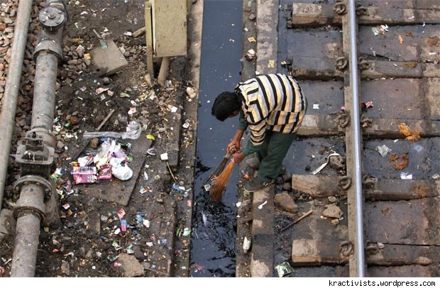

I recently stumbled upon a very interesting theory in the Internet. It's called the [Broken windows theory](http://en.wikipedia.org/wiki/Broken_windows_theory).  To put it in a nut-shell, this theory states that maintaining and monitoring urban environments in a well-ordered condition may stop further vandalism and escalation into more serious crime. So, yeah, this post is about my view on this peculiar theory. Read on!

When I came across this particular post on the Internet, I could immediately connect to it. Here's why. Now, allow me to walk you through a quick analysis here.  Consider a busy Railway Station and a busy Metro Rail Station in Delhi on any given day. I'm pretty sure we all know how much importance public hygiene is given in a Railway Station. India: What can be done to improve sanitary conditions in India's railway stations? This question should give you a better idea about public hygiene in Railway Stations and its importance. Coming back to our theory. So now, we can understand why there is so much of vandalism and other "petty" crimes in the Road Transportation sector and the Indian Railways. The root cause to all this IMO is that, people don't care about public hygiene in these places. Is this the case with the Delhi Metro and the other Metros in India? NO. You are penalized heavily if you try to litter in these places. Again, the above stated theory holds good here. Ergo, you have a well maintained and efficiently functioning Metro. 

The Ripple Effect as we all know, works out to be an advantage as well as a disadvantage when it comes to Public Hygiene. Actually, not so much of an advantage. It just proves to be an alibi. You can even see that happening everyday in front of you through this simple test.  Ask your friend not litter in public. The immediate response he/she comes up with would invariably be "I'll stop littering once everyone else stops". So yeah, there's an alibi. What everyone needs to understand here, is what they already know. They just don't want to accept it because it works in their convenience, doesn't it? You go to another person and ask him to stop littering and he says the same thing and this goes on like an infinite loop. Is it helping the Public Hygiene and Sanitation in anyway? NO.
 

I think it's now safe to say that the Broken windows theory is not that peculiar to us and it indeed is an important theory that needs to be implemented in practice. A solution that I can think of to this problem of Public Hygiene and Sanitation: Break the loop, and Backtrack! Seriously, stop giving "everyone else" as an alibi. You are very much a part of the place around you, and you contribute to it's Public Hygiene in all ways possible. Learn to accept that fact and it's entirely in your hands to make "everyone else" also, to accept this. This way, we're using the Ripple Effect to our advantage!  

All it takes is an extra 200 meters walk to find a Dustbin and dispose off the waste. All it takes is an extra 90 seconds of time to tell our friends not to litter in Public. I think we have all the time in the World to follow this simple routine. Contribute to your surrounding even in the smallest way possible. It definitely inspires a lot of change around in a good way even without your knowledge!

I think I have ranted enough. Comments and criticism are most welcome. :)

May the Force be with you!